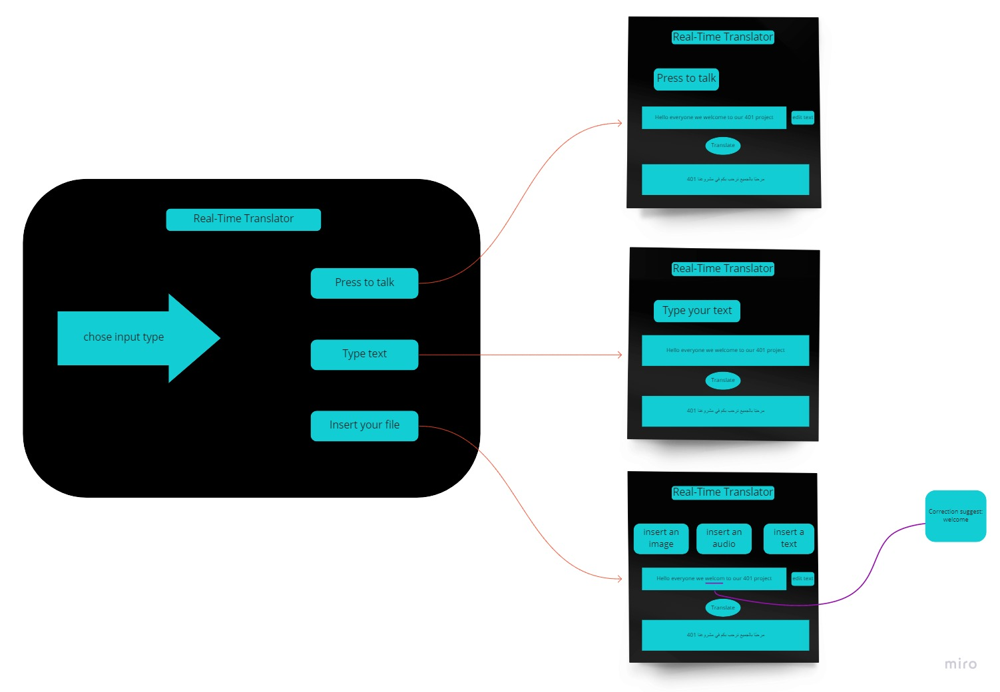
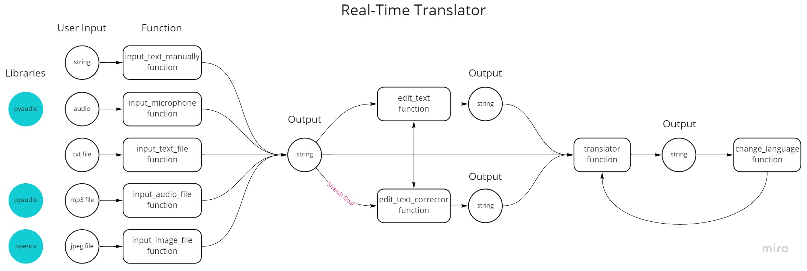

# Project Name

**Real-Time Translator**

&nbsp;

## Team Members

• **Sara Zwairi**

• **Nura Tabanjeh**

• **Anas AbuGhaliha**

• **Mahmoud Salameh**

• **Yahia Qous**

&nbsp;

# Project Description

Real-Time Translator detects the text, then translates it into the language of your choice

&nbsp;

## Wireframes

&nbsp;

## User Stories

### #1

### Title

**Choosing Different Languages**

### User Story sentence

As a person who travels a lot to different countries, I want the ability to choose any language in order to communicate properly with people.

### Feature Tasks

- User can select which language is spoken.
- User can select the language he wants to translate from the options.

### Acceptance Tests

- Ensure that at least top 10 languages are available in the options to translate from.
- Ensure that at least top 10 languages are available in the options to translate.

---

### #2

### Title

**Showing and Editing Text**

### User Story sentence

As a user, I want the ability to see the text I'm speaking and edit it.

### Feature Tasks

- Detect the text spoken from the user.
- Print the text in the same language.
- Edit the text printed.

### Acceptance Tests

- Ensure that the detected text are in the same language user chosen.
- Ensure that printed text are the same as detected.
- Ensure that user can update the text.

---

### #3

### Title

**Inserting Text and Audio Files**

### User Story sentence

As a user, I want to insert an audio file in addition text file.

### Feature Tasks

- Input can be either text file or audio file.

### Acceptance Tests

- Ensure that the output text before tranlation is the same as the input from the file

---

### #4

### Title

**Changing Language**

### User Story sentence

As a user, I want to change the translation into another language.

### Feature Tasks

- Option to select different language after translation.

### Acceptance Tests

- Ensure that the option appear after translation.

---

### #5

### Title

**Translate From Image**

### User Story sentence

As a user, I want to translate the text in the image I insert.

### Feature Tasks

- Input can be an image file with it's different extensions.

### Acceptance Tests

- Ensure that the text detected from the image is the same.

&nbsp;

## Domain Modeling

&nbsp;

## How To Use

### #1 Clone the project repo on your local machine by type '**git clone git@github.com:real-time-translator/real-time-translator.git**'.

### #2 Install dependencies used in project by type '**poetry install**'.

### #3 Run the gui_main_page model by type '**pytest3 -m real_time_translator.gui_main_page**'.

### #4 When the GUI start running you can choose the way you want to translate from.
